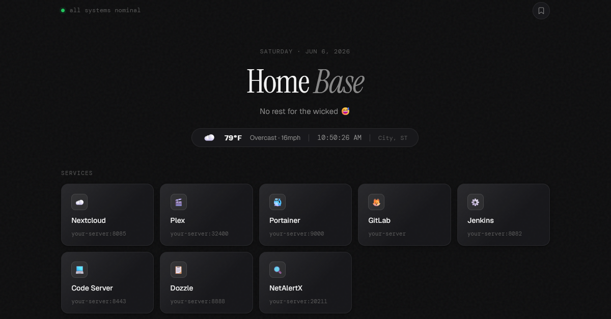
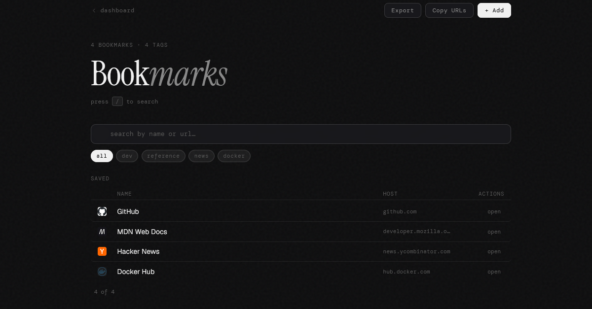

# self-host-dashboard

A clean, minimal homelab dashboard and bookmark manager. No frameworks, no build step, no dependencies — just three files you drop on any static server.



---

## Features

- **Service grid** — cards for all your self-hosted services, configured in one place
- **Bookmark manager** — built-in bookmarks from config + personal bookmarks via browser localStorage
- **Live weather** — powered by [Open-Meteo](https://open-meteo.com/) (free, no API key)
- **Clock + date** — live updating, timezone-aware
- **Dynamic greetings** — time-of-day and weekend-aware, customizable
- **Tag filtering** — filter bookmarks by tag
- **Dark mode** — automatic via `prefers-color-scheme`
- **Responsive** — works on mobile

---

## Quickstart

### 1. Clone or download

```bash
git clone https://github.com/MichaelCoughlinAN/hiimmichael.git
cd hiimmichael/HTML/self-host-dashboard
```

Or just download the three files directly:
- `config.js`
- `index.html`
- `bookmarks.html`

### 2. Edit `config.js`

This is the **only file you need to touch**. Fill in your details:

```js
const CONFIG = {
  name: "Your Name",
  title: ["Home", "Base"],

  location: {
    label: "City, ST",
    lat:    44.9778,
    lon:   -93.2650,
    tz:    "America/Chicago",
  },

  services: [
    { name: "Nextcloud", icon: "☁️", url: "http://your-server:8085", meta: "your-server:8085" },
    // add as many as you want — the grid expands automatically
  ],

  bookmarks: [
    { name: "GitHub", url: "https://github.com", tags: ["dev"] },
    // add as many as you want — tags are optional
  ],
  // ...
};
```

### 3. Serve the files

Any static file server works. The easiest option with Docker:

```bash
docker run -d \
  --name dashboard \
  -p 8080:80 \
  -v $(pwd):/usr/share/nginx/html:ro \
  nginx:alpine
```

Then open `http://localhost:8080` in your browser.

---

## File structure

```
self-host-dashboard/
├── config.js        ← edit this to personalize everything
├── index.html       ← dashboard + service grid
└── bookmarks.html   ← bookmark manager
```

---

## Bookmarks

Built-in bookmarks come from `config.js` and are shared across all sessions. Personal bookmarks can be added via the UI and are stored in `localStorage` — they stay in your browser and never touch a server.

Both types support tags, which appear as filter chips automatically.



---

## Docker Compose

If you want it running persistently alongside other services:

```yaml
services:
  dashboard:
    image: nginx:alpine
    container_name: dashboard
    restart: unless-stopped
    ports:
      - "8080:80"
    volumes:
      - ./self-host-dashboard:/usr/share/nginx/html:ro
```

---

## Weather

Weather is fetched from [Open-Meteo](https://open-meteo.com/) using the coordinates in `config.js`. No account or API key required. Data refreshes every 10 minutes.

---

## License

MIT — do whatever you want with it.
